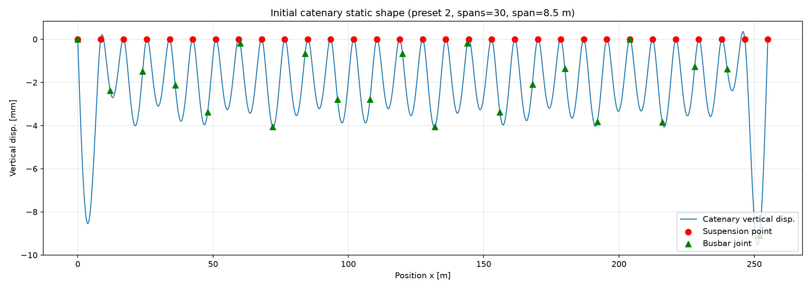
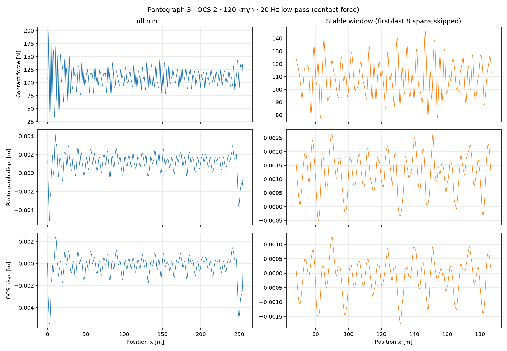

# 受电弓-刚性接触网动力学仿真（假设模态法）

## 模型与算法

- 受电弓：三自由度串联质量-弹簧-阻尼（弓头、上框架、下框架），可选 DSA380 / DSA250 / TSG18F，在 `procs.py` 顶部改 `PANTOGRAPH` 切换。
- 刚性接触网：简支 Euler-Bernoulli 梁 + 吊点等效弹簧/质量 + 汇流排接头集中质量，3 组参数预设。
- 接触：罚函数单边接触，每一步用有效集法（active-set）确定接触状态。
- 时间积分：Newmark-β（β = 0.25，γ = 0.5）。
- 线性求解：Woodbury 公式复用无接触系统矩阵 P 的 Cholesky 分解，把每步接触带来的秩-1 更新降到 O(n²)。
- 后处理：20 Hz 低通滤波。

### 假设模态法（AMM）

把汇流排看成简支 Euler-Bernoulli 梁，位移写成前 NM 阶正弦模态的加权和：

$$
u(x,t) = \sum_{i} \varphi_i(x) \cdot q_i(t)
$$

偏微分方程因此离散成 NM 个常微分方程。吊点和接头的质量、刚度按模态在这些位置的取值 $\varphi_i(x_j)$ 投影进模态坐标。

### 有效集法（active-set）

接触是单边约束：弓头只能压接触线，不能拉。每个时间步先假设当前接触状态，解出位移后检查接触间隙；如果假设与结果不符，就翻转接触状态重新求解，直到自洽。罚刚度 $K_S$ 把接触变成弹簧后，固定接触状态下方程是线性的，通常只需翻转一两次。

### Woodbury 公式

有接触时，有效刚度矩阵为：

$$
K_t = P + K_S \, w \, w^{\mathrm{T}}
$$

其中 $P$ 只由 Newmark 系数和系统矩阵决定，每步不变；$K_S\cdot w \cdot w^{\mathrm{T}}$ 是接触弹簧带来的秩-1 更新。程序先对 $P$ 做一次 Cholesky 分解，然后每步用 Sherman-Morrison 公式在 $O(n^2)$ 内求解，避免每步重新 $O(n^3)$ 分解。$w=[1,0,0,-\varphi]$ 是接触约束方向。

## 环境

使用 [pixi](https://pixi.sh) 管理依赖：

```bash
pixi install
```

依赖见 `pixi.toml`。

## 使用

```bash
pixi run python procs.py
```

仿真结果和图输出到 `result/`。

## 仿真结果




## 参考文献

1. 关金发. 受电弓与刚性接触网动力相互作用研究[D]. 西南交通大学, 2018.
2. 陈龙. 高速刚性接触网-受电弓系统仿真及动态性能研究[D]. 西南交通大学, 2024.

## License

MIT
